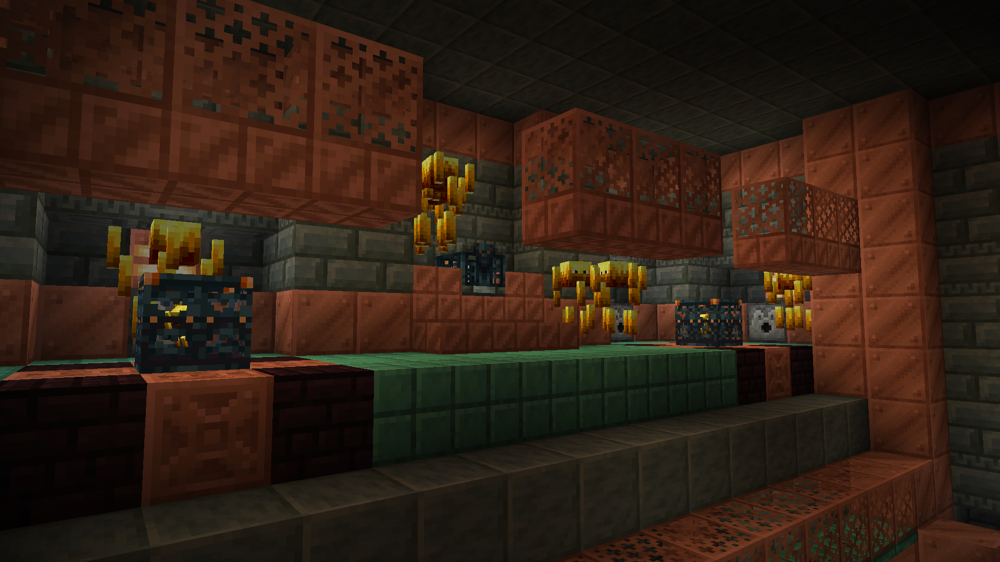
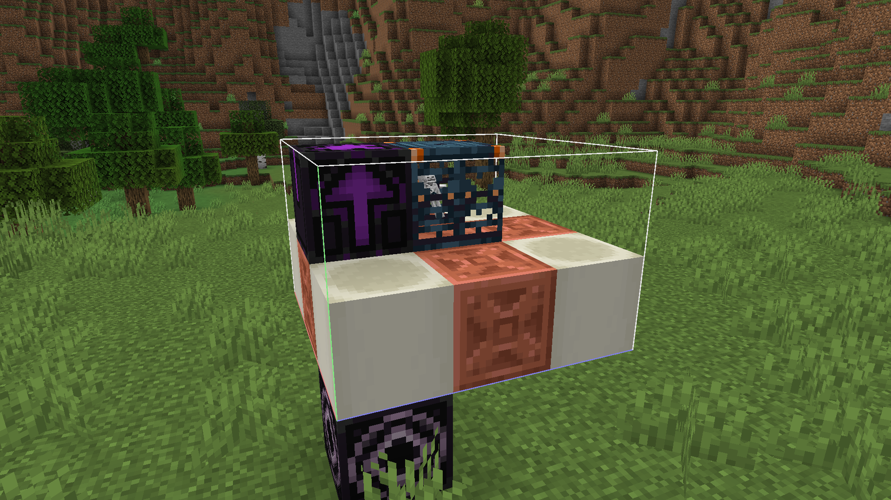
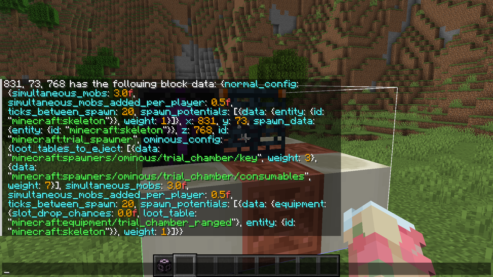
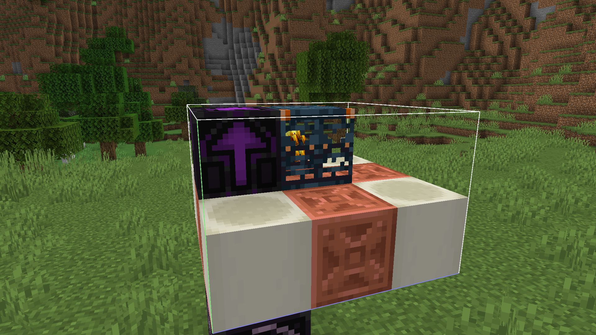
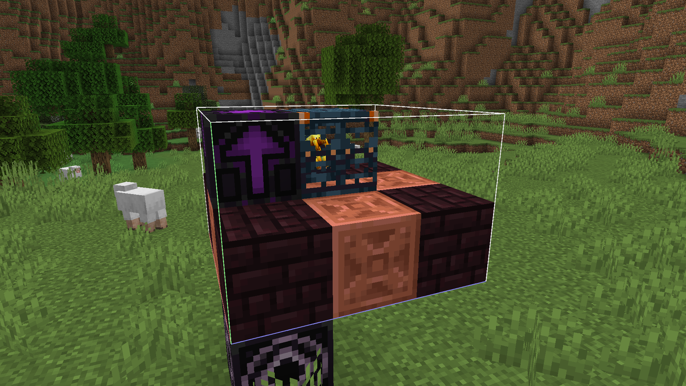
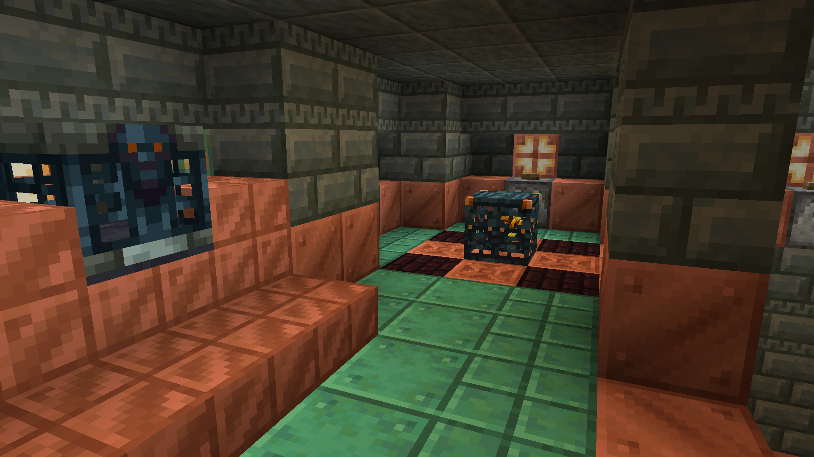

# Custom Trial Spawner Guide

This guide will show you how to add custom mobs to Trial Chambers using Lithostitched, a worldgen library mod.



The only prerequisites for understanding this guide is understanding how datapacks are structured and how to use a structure block.

Please note that for this guide, 'datapack' both refers to standalone datapacks and built-in datapacks in mods. When you put a `data` file in a mod's `resources` file, the game reads from it like it is a datapack.

## 0/3 - Preparation

Trial Chambers have three categories of mobs it uses: ranged, melee, and small melee. Choose a category that your mob will be in. Some rooms will only have one type of mob (i.e. only Strays), some rooms will have multiple types of mobs (i.e. Skeletons and Spiders). The category you choose will determine which rooms your mob will spawn in.

## 1/3 - The Spawner Itself

First, we need a spawner piece to actually generate in the structure. For this example, the Blaze will be used as the mob we are adding.

Open a creative world and grab yourself a structure block. Depending on the mob category, type the following in:

- Ranged: `minecraft:trial_chambers/spawner/ranged/skeleton`
- Melee: `minecraft:trial_chambers/spawner/melee/zombie`
- Small Melee: `minecraft:trial_chambers/spawner/small_melee/cave_spider`

Load the structure and the trial spawner should appear.



Now that we have a vanilla trial spawner to work off of, let's add a custom mob to it instead. Look at the trial spawner and type `/data get block` and let the game autofill the block's coordinates. When you run the command you should see this:



All this data can be quite overwhelming, but all we care about here is the entity ids which we will be changing. Run the following commands to modify the trial spawner's data:

`/data modify block <coordinates> normal_config.spawn_potentials[0].data.entity.id set value "<your entity id>"`

`/data modify block <coordinates> ominous_config.spawn_potentials[0].data.entity.id set value "<your entity id>"`

`/data remove block <coordinates> spawn_data`

When you look inside the trial spawner, you should see your custom entity. (If you don't see anything, make sure you're not on Peaceful and that you typed the entity name correctly.)



One last thing before we save the structure: Change the blocks on the corners to let the player get an idea of what mob they're going to fight when they see your trial spawner. For this guide's example, it'll be changed to nether bricks since Blazes reside in nether fortresses.



Now we can save the structure. Open up the structure block, flip it to Save mode and save the structure. Move it into your datapack under the `<namespace>/structure` folder. In the example datapack, it is put in as `example/structure/ranged/blaze.nbt`, but it can be named whatever you want and in as many/as few subfolders as you want.

> **Important Note**
> 
> If you are adding a ranged mob, you need to do this step again. There are two types of ranged spawners: Regular ranged and slow ranged. Replace `minecraft:trial_chambers/spawner/ranged/skeleton` in the guide with `minecraft:trial_chambers/spawner/slow_ranged/skeleton` and follow the same steps.

## 2/3 - Template Pools

Template pools primarily contain one or more references of structure nbt files for use in jigsaw structures like Trial Chambers and Villages. For example, each village type has a `houses` template pool which lists all of the house structure nbt files and their weights (their likeliness to spawn compared to other houses).

Our trial spawner(s) need to be referenced from a template pool, as we will wire that template pool into the Trial Chambers's list of trial spawner template pools with the help of Lithostitched in step 3.

In your datapack, create a json file under the `<namespace>/worldgen/template_pool` folder. In the example datapack, it is at `.../template_pool/ranged/blaze.json`, but it can be named whatever you want and in as many/as few subfolders as you want.

Open the file in a text editor and paste this in:

```json
{
  "elements": [
    {
      "element": {
        "element_type": "minecraft:single_pool_element",
        "location": "<your structure nbt location>",
        "processors": "minecraft:empty",
        "projection": "rigid"
      },
      "weight": 1
    }
  ],
  "fallback": "minecraft:empty"
}
```

The only field here relevant to the guide is `location`. This references a file in the `<namespace>/structure` folder. For example, if a structure nbt file is at `namespace/structure/village/house3.nbt`, the location field would be `"namespace:village/house3"`. 

Change the `location` field to be the location of your structure nbt file. In the example datapack, since the nbt file is at `example/structure/ranged/blaze.nbt`, the location in the template pool file is `"example:ranged/blaze"`.

## 3/3 - Lithostitched

Finally, we'll use the Lithostitched mod to add the your newly created template pool(s) to the list of template pools that the Trial Chambers roll for the spawners. Lithostitched adds template pool tags to handle this functionality.

Create a json file in the `data/lithostitched/tags/worldgen/template_pool/trial_spawner` folder. Depending on the mob category, name your file the following:

- Ranged: `ranged.json` and `slow_ranged.json` (follow the steps once for each file)
- Melee: `melee.json`
- Small Melee: `small_melee.json`

Open the file in a text editor and paste this in:

```json
{
  "values": [
    "<your template pool id>"
  ]
}
```

Change the placeholder value to the id of your template pool file. In the example datapack, since the template pool file is at `example/worldgen/template_pool/ranged/blaze.json`, the location in the template pool file is `"example:ranged/blaze"`.

If you've done everything correctly, you're done! Open a new world and teleport to/spawn in a few Trial Chambers and you should see your custom spawner in the mix. If you don't see it, double check each step in the guide and reference the example datapack to see if you made a mistake somewhere.

